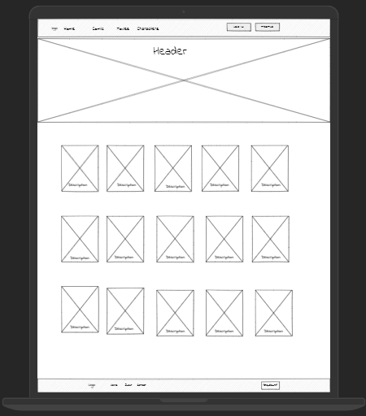

# 6Pixels Team :

- Dena Kofahi. 
- Khaled Tahat. 
- LAITH HAYAJNEH. 
- Mohammad Alkhateeb 
- Sondos Al-jawhary. 
- Tariq Abu-Laban. 

GitHub Link: https://github.com/6Pixels  
Trello Board: https://trello.com/b/Wqx14PgP/project-301

## Cooperation Plan

1. What are the key strengths of each person on the team? 

   - Dena Kofahi : `Design`.
   - Khaled Tahat : `good discovery skills`.
   - Laith Hayajneh : `CSS3`.
   - Mohammad Alkhateeb : `JavaScript`.
   - Sondos Al-jawhary : `Team-worker`.
   - Tariq Abu-Laban : `Leadership`.
      
      

2. How can you best utilize these strengths in the execution of your project? 
   Putting all there strenghts together is the secert of success in our work.

3. In which professional competencies do you each want to develop greater strength? 
   We would like to grow our experiance and coding skills with React, bulding Back-end servers as well dealing with mongoDBs.

4. Knowing that every person in your team needs to understand all aspects of the project, how do you plan to approach the day-to-day work? 
   I will use the concept of pair programming, assign each pair to different tasks in front and back ends in addition I will then change pairs members so all of us can work together and gain experience from each other.

5. What will be your group’s process to resolve conflict, when it arises? 
   firstly, no one is allowed to push or make any pull requests without being in a merge party where all the team members must guther in one room to push work and pull branches, if any conflict showd up all group members will work together to solve those conflicts.

6. What will your team do if one person is taking over the project and not letting the other members contribute? 
   will he must be a professional if he want to do so, yet this is not allowed and a complaint report will be submitted to the instructor.

7. How will you approach each other and the challenges of the project knowing that it is impossible for all members to be at the exact same place in understanding and skill level? 
   we all are going to try our best in helping each other by trying to answer any question showd up, explain things if any felt lost or was not following and I will try to change the pairs every day to make sure every team member had the chance to work with every other team members.

8. How will you raise concerns to members who are not adequately contributing? 
   Will firstly try to talk to him and try to convinces him that it is in his intrest to work and think of things, after all if this came out with no good, a complaint report will be submitted to the instructor.

9. How and when will you escalate the conflict if your resolution attempts are unsuccessful? 
   If no way of mine can solve the conflict, a complaint report will be submitted to the instructor.

10. What hours will you be available to communicate? 
    `10:00 am till 5:00 pm`

11. What platforms will you use to communicate (ie. Slack, phone …)? 
    `Slack`, `Discord`, `Zoom`

12. How often will you take breaks? 
    `As needed`, maybe every two hours.

13. What is your plan if you start to fall behind? 
    Will in this case we will push ourselfes and work harder to more extra hours, and God does not burden a soul beyond its capacity. :)

14. How will you communicate after hours and on the weekend? 
    We can use `Slack` and we can creat our `Zoom` meeting.

15. What is your strategy for ensuring everyone’s voice is heard? 
    Will leave noates in our `Slack` channel or we can use Zoom by raising hands and other interactions.

16. How will you ensure that you are creating a safe environment where everyone feels comfortable speaking up? 
    every one is a leader.
    Work Plan

17. How you will identify tasks, assign tasks, know when they are complete, and manage work in general? 
    We are planning to use `Trello board` to manage these stuff.

18. What project management tool will be used? 
    `Trello`, `Git Process`, `VS Code`

19. What components of your project will live on GitHub? 
    `Front-end`, `Back-end`

20. How will you share the repository with your teammates? 
    We are all in the one organization on github,

21. What is your Git flow? 
    When a feature is complete it is merged into the develop branch

22. Will you be using a PR review workflow? If so, consider:
    How many people must review a PR? 
    `2 People`.

23. Who merges PRs? 
    `The Leader` or every one who pushes work but the presence of the user is a must.

24. How often will you merge? 
    `As needed` but usually At the end of the day.

25. How will you communicate that it’s time to merge? 
    `Slack`, and we will decide that in `Zoom` meeting.

 
 

## Meet Our Team Members

 | Mohammed Khateeb

 | Tariq Abulaban

 | Khaled Tahat

 | Laith Hayajneh

 | Dina Kofahi

 | Sondos Jawhary

## Project Wire Frames

 | Home Page
 

 | Movies Page
 

 | Comics & Characters Page
 

 | Login Page
 

 | Profile Page
 

`comic-front-end (repository)
├── App.css
├── App.js
├── App.test.js
├── Components
│   ├── Block
│   ├── ContactForm
│   ├── ContentBlock
│   │   ├── LeftContentBlock
│   │   ├── RightContentBlock
│   ├── CustomButtons
│   │   └── Button.js
│   ├── FirstLayer
│   │   ├── Characters.js
│   │   ├── Comics.js
│   │   ├── Footer.js
│   │   ├── Header.js
│   │   ├── Movies.js
│   │   └── Profile.js
│   ├── Grid
│   │   ├── GridContainer.js
│   │   └── GridItem.js
│   ├── MiddleBlock
│   ├── SecondLayer
│   │   ├── CharModal.js
│   │   ├── LogInButton.js
│   │   ├── LogOutButton.js
│   │   ├── Profile.js
│   │   ├── SearchForm.js
│   │   ├── UpdateFormModal.js
│   │   ├── testP.js
│   │   ├── testP2.js
│   │   └── testP3.js
│   ├── ThirdLayer
│   │   ├── AnimatedProgressProvider.js
│   │   ├── ApperanceTable.js
│   │   └── PowersChart.js
│   └── assets
│       ├── css
│       │   └── material-kit-react.css.map
│       ├── img
│       │   ├── 19681.jpg
│       │   ├── 2660432.png
│       │   ├── 2660432.png:Zone.Identifier
│       │   ├── 328.jpg
│       │   ├── 328886.jpg
│       │   ├── WireFrame
│       │   │   ├── TNGRRLUMA-U01TUDCP3HT-847ceef88e12-512.jpg
│       │   │   ├── TNGRRLUMA-U01TUDCP3HT-847ceef88e12-512.jpg:Zone.Identifier
│       │   │   ├── comic&characters.png
│       │   │   ├── homepage2.png
│       │   │   ├── login.png
│       │   │   ├── movies.png
│       │   │   └── profile.png
│       │   ├── apple-icon.png
│       │   ├── bg.jpg
│       │   ├── bg2.jpg
│       │   ├── bg3.jpg
│       │   ├── bg4.jpg
│       │   ├── bg44.jpg
│       │   ├── bg7.jpg
│       │   ├── comic.jpg
│       │   ├── comiccc.jpeg
│       │   ├── examples
│       │   │   ├── clem-onojegaw.jpg
│       │   │   ├── clem-onojeghuo.jpg
│       │   │   ├── cynthia-del-rio.jpg
│       │   │   ├── mariya-georgieva.jpg
│       │   │   ├── olu-eletu.jpg
│       │   │   ├── studio-1.jpg
│       │   │   ├── studio-2.jpg
│       │   │   ├── studio-3.jpg
│       │   │   ├── studio-4.jpg
│       │   │   └── studio-5.jpg
│       │   ├── faces
│       │   │   ├── avatar.jpg
│       │   │   ├── camp.jpg
│       │   │   ├── card-profile1-square.jpg
│       │   │   ├── card-profile2-square.jpg
│       │   │   ├── card-profile4-square.jpg
│       │   │   ├── card-profile5-square.jpg
│       │   │   ├── card-profile6-square.jpg
│       │   │   ├── christian.jpg
│       │   │   ├── kendall.jpg
│       │   │   └── marc.jpg
│       │   ├── favicon.png
│       │   ├── hero.jpg
│       │   ├── img.jpg
│       │   ├── iron.jpg
│       │   ├── justice.jpg
│       │   ├── landing-bg.jpg
│       │   ├── landing.jpg
│       │   ├── login.jpg
│       │   ├── looo.jpg
│       │   ├── movee.jpg
│       │   ├── movie1.jpg
│       │   ├── movie2.jpg
│       │   ├── movie3.jpg
│       │   ├── movie4.jpg
│       │   ├── movies.jpg
│       │   ├── movvv.jpg
│       │   ├── profile-bg.jpg
│       │   ├── profile.jpg
│       │   ├── sign.jpg
│       │   ├── superheroes.jpg
│       ├── jss
│       ├── material-kit-react
│       │   ├── Parallax.js
│       │   ├── components
│       │   │   ├── GridContainer.js
│       │   │   ├── GridItem.js
│       │   │   ├── NavPills.js
│       │   │   ├── badgeStyle.js
│       │   │   ├── buttonStyle.js
│       │   │   ├── cardBodyStyle.js
│       │   │   ├── cardFooterStyle.js
│       │   │   ├── cardHeaderStyle.js
│       │   │   ├── cardStyle.js
│       │   │   ├── customDropdownStyle.js
│       │   │   ├── customInputStyle.js
│       │   │   ├── customLinearProgressStyle.js
│       │   │   ├── customTabsStyle.js
│       │   │   ├── footerStyle.js
│       │   │   ├── headerLinksStyle.js
│       │   │   ├── headerStyle.js
│       │   │   ├── infoStyle.js
│       │   │   ├── material-kit-react.js
│       │   │   ├── navPillsStyle.js
│       │   │   ├── paginationStyle.js
│       │   │   ├── parallaxStyle.js
│       │   │   ├── snackbarContentStyle.js
│       │   │   └── typographyStyle.js
│       │   ├── customCheckboxRadioSwitch.js
│       │   ├── imagesStyles.js
│       │   ├── modalStyle.js
│       │   ├── parallaxStyle.js
│       │   ├── popoverStyles.js
│       │   ├── tooltipsStyle.js
│       │   └── views
│       │       ├── components.js
│       │       ├── componentsSections
│       │       │   ├── basicsStyle.js
│       │       │   ├── carouselStyle.js
│       │       │   ├── completedStyle.js
│       │       │   ├── downloadStyle.js
│       │       │   ├── exampleStyle.js
│       │       │   ├── javascriptStyles.js
│       │       │   ├── loginStyle.js
│       │       │   ├── navbarsStyle.js
│       │       │   ├── notificationsStyles.js
│       │       │   ├── pillsStyle.js
│       │       │   ├── tabsStyle.js
│       │       │   └── typographyStyle.js
│       │       ├── landingPage.js
│       │       ├── landingPageSections
│       │       │   ├── productStyle.js
│       │       │   ├── teamStyle.js
│       │       │   └── workStyle.js
│       │       ├── loginPage.js
│       │       └── profilePage.js
│       └── scss
│           ├── core
│           │   └── variables
│           ├── material-kit-react.scss
│           └── plugins
├── Login.css
├── Login.js
├── common
│   ├── Button
│   ├── Container
│   ├── Input
│   ├── ScrollToTop
│   ├── SvgIcon
│   ├── TextArea
│   ├── types.ts
│   └── utils
├── content
│   ├── AboutContent.json
│   ├── ContactContent.json
│   ├── IntroContent.json
│   ├── MiddleBlockContent.json
│   ├── MissionContent.json
│   └── ProductContent.json
├── index.css
├── index.js
├── logo.svg
├── pages
│   ├── Home
│   └── Slider
│       ├── Ourteam.js
│       └── Slider.js
├── reportWebVitals.js
├── router
├── setupTests.js
└── styles
    └── styles.ts`
